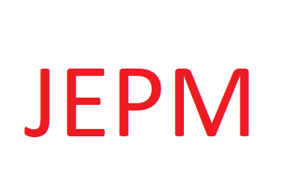

<a name="readme-top"></a>


<div align="center">
  
  
  <br/>

  <h3><b>My Portfolio</b></h3>

</div>


# 📗 Table of Contents

- [📖 About the Project](#about-project)
  - [🛠 Built With](#built-with)
    - [Tech Stack](#tech-stack)
    - [Key Features](#key-features)
  - [🚀 Live Demo](#live-demo)
- [💻 Getting Started](#getting-started)
  - [Setup](#setup)
  - [Prerequisites](#prerequisites)
  - [Install](#install)
  - [Usage](#usage)
  - [Run tests](#run-tests)
  - [Deployment](#triangular_flag_on_post-deployment)
- [👥 Authors](#authors)
- [🔭 Future Features](#future-features)
- [🤝 Contributing](#contributing)
- [⭐️ Show your support](#support)
- [🙏 Acknowledgements](#acknowledgements)
- [❓ FAQ (OPTIONAL)](#faq)
- [📝 License](#license)


# 📖 My Portfolio <a name="about-project"></a>

> This is my Portfolio I created it using HTML, CSS and JavaScript.

## 🛠 Built With <a name="built-with"></a> 


1- HTML.
2- CSS.
3- Liners.

### Tech Stack <a name="tech-stack"></a>

> Describe the tech stack and include only the relevant sections that apply to your project.

<details>
  <summary>Client</summary>
  <ul>
    <li><a href="https://reactjs.org/">HTML</a></li>
    <li><a href="https://reactjs.org/">CSS</a></li>
    <li><a href="https://reactjs.org/">JavaScript</a></li>
  </ul>
</details>


### Key Features <a name="key-features"></a>

> Describe between 1-3 key features of the application.

- Added index.html file.
- Added style.css file.

<p align="right">(<a href="#readme-top">back to top</a>)</p>


## 🚀 Live Demo <a name="live-demo"></a>

>Coming soon

<p align="right">(<a href="#readme-top">back to top</a>)</p>


## 💻 Getting Started <a name="getting-started"></a>

> Describe how a new developer could make use of your project.

To get a local copy up and running, follow these steps.

### Prerequisites

1. Web browser.
2. Code editor.
3. Git-smc.

### Setup

Clone this repository to your desired folder:

Run this command:

```sh
  cd my-folder
  git clone https://github.com/pradmon/MyPortfolio.git
```

### Install

Install this project with:

Run this command:

```sh
  cd my-project
  npm install
```

### Usage

To run the project, execute the following command:

Open index.html using live server extension.

### Run tests

> Coming soon.

### Deployment

> Coming soon.

<p align="right">(<a href="#readme-top">back to top</a>)</p>


## 👥 Authors <a name="authors"></a>

👤 Jorge E Prada M

- GitHub: [@githubhandle](https://github.com/pradmon)
- Twitter: [@twitterhandle](https://twitter.com/praduar)
- LinkedIn: [LinkedIn](https://www.linkedin.com/in/jorgepradamoncada/)

<p align="right">(<a href="#readme-top">back to top</a>)</p>


## 🔭 Future Features <a name="future-features"></a>


- [ ] Add Header.
- [ ] Add Footer.
- [ ] Add more styles.

<p align="right">(<a href="#readme-top">back to top</a>)</p>


## 🤝 Contributing <a name="contributing"></a>

Contributions, issues, and feature requests are welcome!

Feel free to check the [issues page](../../issues/).

<p align="right">(<a href="#readme-top">back to top</a>)</p>


## ⭐️ Show your support <a name="support"></a>

If you like this project just give it a start.

<p align="right">(<a href="#readme-top">back to top</a>)</p>


## 🙏 Acknowledgments <a name="acknowledgements"></a>

I would like to thank Microverse.

<p align="right">(<a href="#readme-top">back to top</a>)</p>


## 📝 License <a name="license"></a>

This project is [MIT](./LICENSE) licensed.

<p align="right">(<a href="#readme-top">back to top</a>)</p>